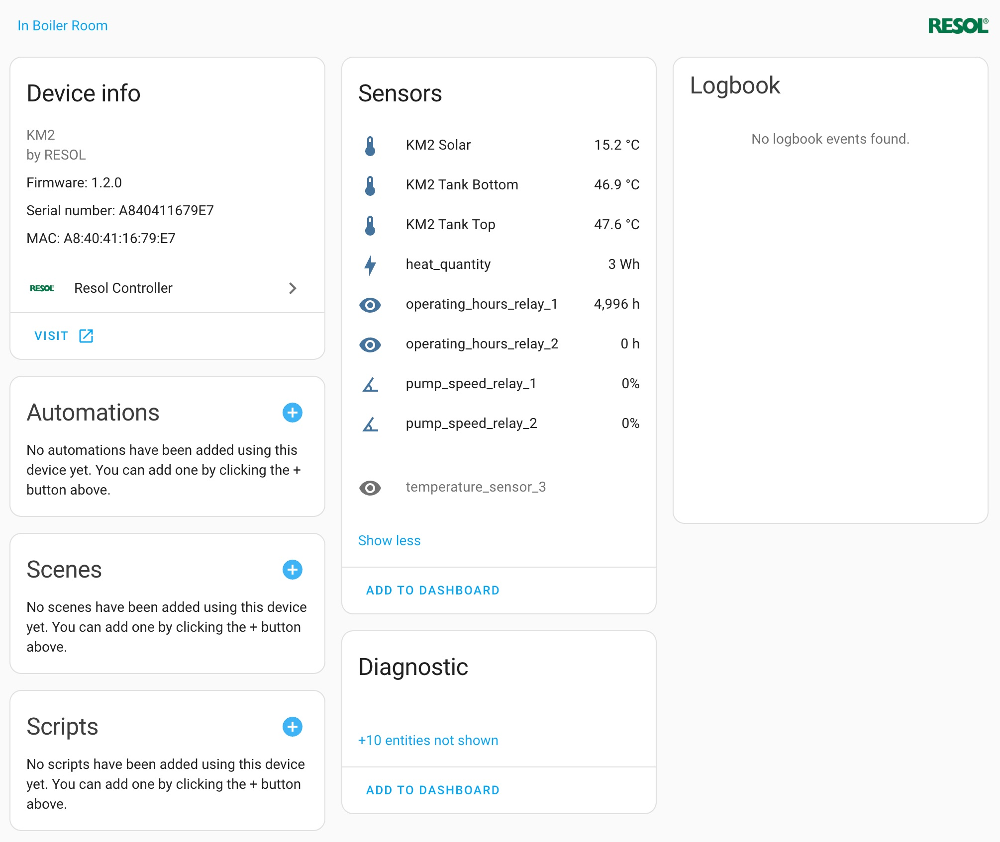

<!-- prettier-ignore -->
[![GitHub Release][releases-shield]][releases]
[![GitHub Activity][commits-shield]][commits]
[![License][license-shield]][license]

[![hacs][hacsbadge]][hacs]
![Project Maintenance][maintenance-shield]

[![Community Forum][forum-shield]][forum]


# Hass-Resol-KM2

[Home Assistant](https://home-assistant.io/) custom component to log sensor information from Resol devices using KM2 communication module. This is my first time programming in Python and publishing to Github. Over time, this component has been updated to also work with [DL2 and JSON Live Data Server]([url](https://github.com/evercape/hass-resol-KM2/issues/3)).

This component was inspired by [dm82m/hass-Deltasol-KM2](https://github.com/dm82m/hass-Deltasol-KM2/) and I used some of dm82m's code to fetch the KM2's data via webservice. 

## Changes and improvements:
I have made the following changes to dm82m's component. Some are improvements, others maybe not so. The main purpose for me was to learn Python, program my first HASS custom integration from scratch and to publish to github.

- Setup via `custom_flow` using multiple steps
- Add port as connection detail
- Combine KM2 specific sensors into devices as suggested by [hoppel118](https://github.com/dm82m/hass-Deltasol-KM2/issues/24)
- Group sensors into 'useful' device sensors and less important diagnostics sensors
- Each sensor entity_id incorporate unique device name, yet presents friendly sensor name
- Update of the full dataset of all sensors belonging to a KM2 device with single API call
- Sensors that are disabled are skipped for updates, same with sensors where the state value has not changed
- Present additional device specific attributes on each sensor
- Extensive debug logging (hopefully helpful to anyone going through the same learning curve as myself)
- Adding translations

There is a disadvantage in my integration: I only focused on KM2, even though I am certain that this integration could easily be amended to include DL2, KM1, VBUS and other Resol devices. The reason for this is that I simply don't own any other Resol device and henceforth could not test this. If anyone is interested to extend this integration, please let me know, happy to do so. 


## My own wish list for future improvements:
- ~~HACS integration~~
- Pull (via curl) the device uptime from Web Interface into new device diagnostics sensor
- Extend translations
- Extend from KM2 module to DL2 (DONE), KM1 and VBUS API (DONE) (I only own 2x KM2s, so would rely on someone's access to a device)
- Companian card with visualization
- Logging into txt file
- Synchronise device and integration 'custom name'
- support for https

## Installation

### HACS

1. Just search for "_Resol_Controller" integration in HACS. It will be automatically installed to the `custom_integration/resol` directory
2. Restart Home Assistant.
3. In the HA UI go to "Configuration" -> "Integrations" click "+" and search for "_Resol_Controller"
4. Follow the UI based [Configuration](#Configuration)


### Manual install

Create a directory called `resol` in the `<config directory>/custom_components/` directory on your Home Assistant instance. Install this component by copying all files in `/custom_components/resol/` folder from this repo into the new `<config directory>/custom_components/resol/` directory you just created.

This is how your custom_components directory should look like:

```bash
custom_components
├── resol
├────── translations
│   ├───└── en.json
│   ├── __init__.py
│   ├── config_flow.py
│   ├── const.py
│   ├── manifest.json
│   ├── resolapi.py
│   ├── sensor.py
│   └── strings.json  
```

## Configuration

I have tested the component with two olrder KM2 controllers, one on firmware 1.1 and the other on 1.2. Firmware updates can be found on [Resol's website](https://www.resol.de/en/produktdetail/209)

Instead of relying on YAML code to setup this component, I opted for a custom flow which setups actual devices with its corresponding sensors. 

To start the setup of this custom integration:
- go to Home Assistant's Integration Dashboard
- Add Integration
- Search for Resol Controller
- Follow the prompts in step 1 and 2

### Step 1 - Connection details
The following connection details are required to detect the Resol KM2 device:
- Host: internal IP or hostname
- Port: default 80, change to any http port and make sure port forwarding on your router is activated.
- Username: default 'admin'
- Password: Password of the KM2. If you have not changed it, the default password is typically printed on a sticker attached to the device
  


### Step 2 - Device options
The following optional parameters can be configured in step 2 of the setup process:
- Friendly custom name: Default is the device name as provided by the KM2 controller.
- Polling interval: Default 60 seconds, time delta to pull new sensor data. 
- Group sensors on device page: If this option is ticked, the actual device data such as temperature, pump speed will be seperated from diagnostics data such as software version, system time, error masks etc. This will reduce history database within HASS and visually seperate device data on the device page.
- Disable diagnostic sensors: If ticked, diagnostic sensors will be disabled by default. You can enable them via the UI.
  


### Controllers and devices
After succcessful setup, the controllers representing Resol KM2 devices should show up in a list. The Resol logo is not yet shown and a [pull request](https://github.com/home-assistant/brands/pull/4904) in https://brands.home-assistant.io is currently pending.


On any controller's device page, the hardware related device information is displayed, together with sensors typically grouped into main entity sensors and diagnostics. A quicklink to the Resol KM2 module is available under the 'Visit' link. 

As you can see in the following screenshot, I have manually disabled some of the temperature and pump speed sensors and enabled some other diagnostics sensors using the HASS GUI.



### Sensors
Sensors are registered to each device (which is an instance of Resol Controller) as `sensor.km2_{serial}_{sensor_name}` with an easy to read friendly name of `sensor_name`. Additional attributes are presented on each sensor:
- Product Description, Destination Name, Source Name: Some internal names from Resol
- Internal Unique ID: `{serial}_{header}_{sensor_hex}`
- Device Name: as registered in the KM2 web interface upon registration
- Vendor Product Serial: serial number of the KM2 interface, typically matches the MAC address of the Ethernet adapter
- Vendor Firmware Version: as provided by the KM2 web interface upon registration
- Vendor Product Build: as provided by the KM2 web interface upon registration
- Vendor Product Features: as provided by the KM2 web interface upon registration
  


## Troubleshooting
Please set your logging for the this custom component to debug during initial setup phase. If everything works well, you are safe to remove the debug logging:

```yaml
logger:
  default: warn
  logs:
    custom_components.resol: info
```
Here is a copy of my log files for 2x KM2 devices successfully setup, 19 sensors for each device registered, and updates over time:

```
2023-11-17 09:18:24.495 INFO (MainThread) [custom_components.resol]
2023-11-17 09:20:48.454 INFO (MainThread) [custom_components.resol] A840411679E7: All '19' sensors have registered.
2023-11-17 09:21:21.197 INFO (MainThread) [custom_components.resol] A8404116CFCF: All '19' sensors have registered.
2023-11-17 09:22:21.426 INFO (MainThread) [custom_components.resol] A8404116CFCF: A total of '2' sensors have updated, '10' are disabled and skipped update, '7' sensors value remained constant and '0' sensors occured any errors.
2023-11-17 09:23:06.922 INFO (MainThread) [custom_components.resol] A840411679E7: All '19' sensors have registered.
2023-11-17 09:23:48.677 INFO (MainThread) [custom_components.resol] A840411679E7: A total of '2' sensors have updated, '10' are disabled and skipped update, '7' sensors value remained constant and '0' sensors occured any errors.
2023-11-17 09:24:07.140 INFO (MainThread) [custom_components.resol] A840411679E7: A total of '0' sensors have updated, '10' are disabled and skipped update, '9' sensors value remained constant and '0' sensors occured any errors.
2023-11-17 09:24:48.680 INFO (MainThread) [custom_components.resol] A840411679E7: A total of '1' sensors have updated, '10' are disabled and skipped update, '8' sensors value remained constant and '0' sensors occured any errors.
2023-11-17 09:25:07.141 INFO (MainThread) [custom_components.resol] A840411679E7: A total of '1' sensors have updated, '10' are disabled and skipped update, '8' sensors value remained constant and '0' sensors occured any errors.
```

## Credits

Thank you for inspiring me to start learning Python and re-programming the existing deltasol KM2 controller from scratch: [dm82m](https://github.com/dm82m)

Thank you for in-depth documentation on Resol controllers: [danielwippermann](https://github.com/danielwippermann), and this [discussion](https://github.com/danielwippermann/resol-vbus/issues/32) is worth a read.


[releases-shield]: https://img.shields.io/github/release/evercape/hass-resol-KM2.svg?style=for-the-badge
[releases]: https://github.com/evercape/hass-resol-KM2/releases

[commits-shield]: https://img.shields.io/github/commit-activity/y/evercape/hass-resol-KM2?style=for-the-badge
[commits]: https://github.com/evercape/hass-resol-KM2/commits/master

[license-shield]: https://img.shields.io/github/license/evercape/hass-resol-KM2.svg?style=for-the-badge
[license]: https://github.com/evercape/hass-resol-KM2/blob/main/LICENSE

[hacs]: https://github.com/custom-components/hacs
[hacsbadge]: https://img.shields.io/badge/HACS-Custom-orange.svg?style=for-the-badge

[maintenance-shield]: https://img.shields.io/badge/maintainer-Martin%20%40evercape-blue.svg?style=for-the-badge

[buymecoffee]: https://www.buymeacoffee.com/evercape
[buymecoffeebadge]: https://img.shields.io/badge/buy%20me%20a%20coffee-donate-yellow.svg?style=for-the-badge

[forum-shield]: https://img.shields.io/badge/community-forum-brightgreen.svg?style=for-the-badge
[forum]: https://community.home-assistant.io/t/resol-km2-controller/
